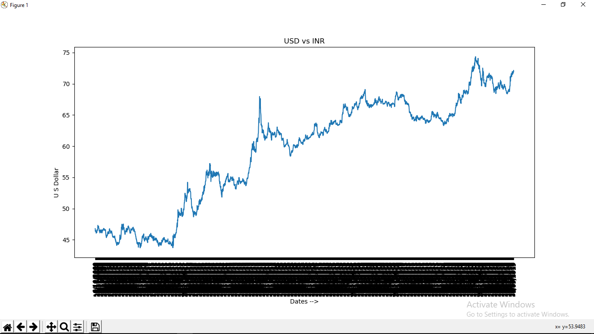

# WebScrap_INRvsUSD
Python code to scrap INR vs USD data and visualize it.

Data is Scraped from the web page
"https://www.currency-converter.org.uk/currency-rates/historical/table/USD-INR.html"

# Declaration
Data scraped only for educational purpose not for any commercial purpose

The visualized data as on 05-Sep-2019

The Black label in x-axis is Dates from 06-10-2009 to 04-09-2019 overlapping
